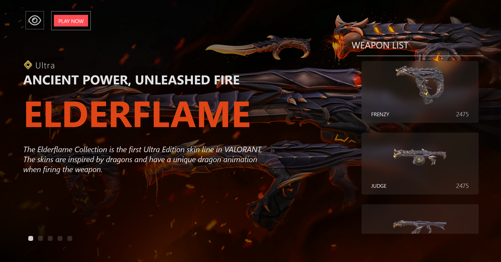
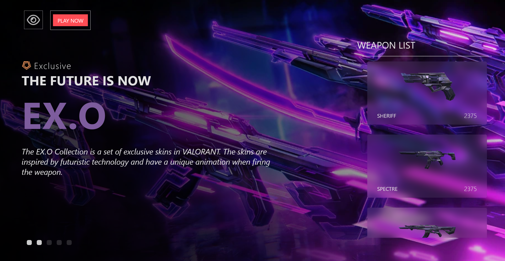
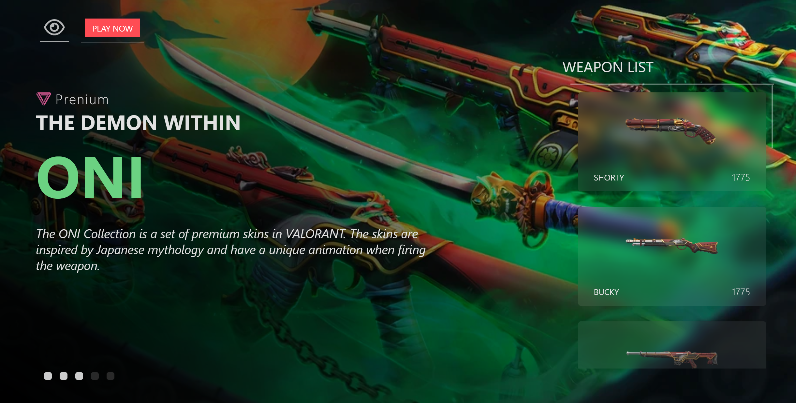
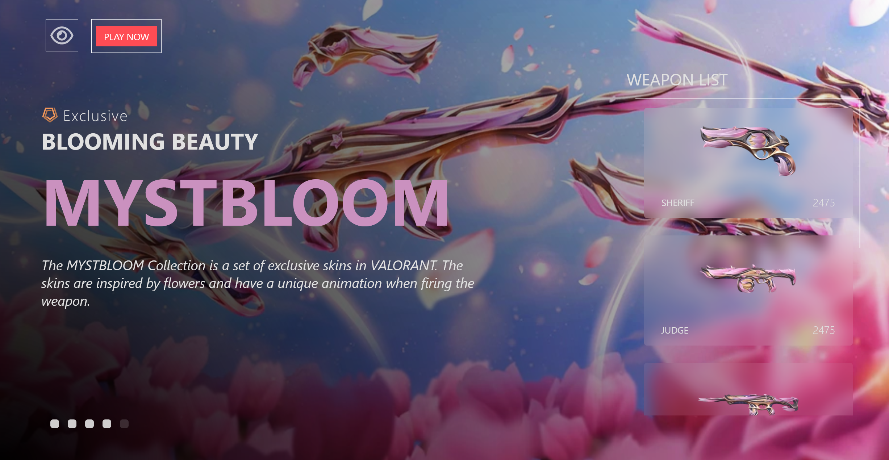
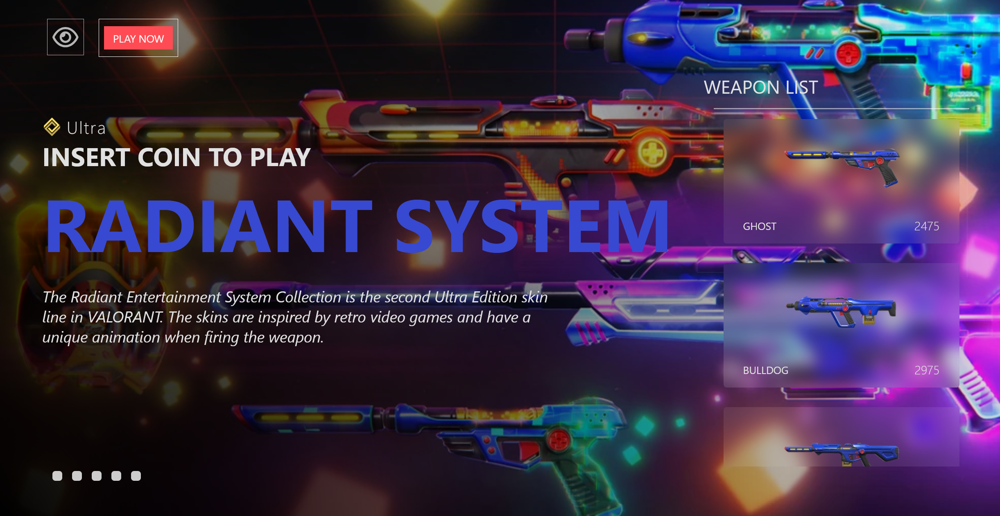

# Valorant Weapon Showcase

This project was made to learn about React. It is a simple web application that showcases various weapons.

## Preview

Here are some preview images of the application:






Enjoy exploring the Weapon Showcase!

## Getting Started

To start the project, follow these steps:

1. Clone the repository:
    ```bash
    git clone https://github.com/yourusername/weapon-showcase.git
    ```
2. Navigate to the project directory:
    ```bash
    cd weapon-showcase
    ```
3. Install the dependencies:
    ```bash
    npm install
    ```
4. Start the React application:
    ```bash
    npm start
    ```
5. In a separate terminal, run the JSON server:
    ```bash
    npx json-server --watch data/data.json --port 8080
    ```
